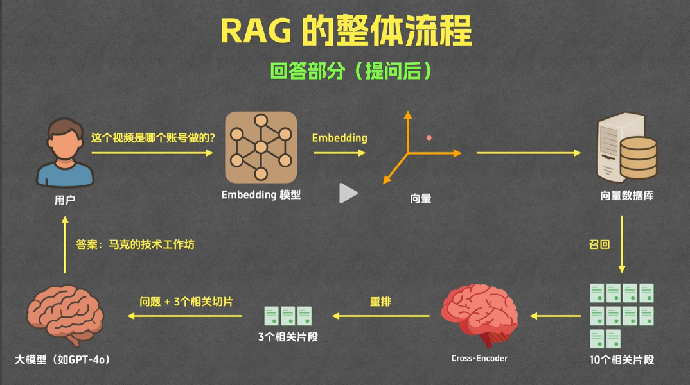

## RAG (Retrieval-Augmented Generation 检索增强生成)

- RAG 是一种结合了信息检索 (Retrieval) 和生成式模型 (Generation) 的技术方案。
- 工作流程:
  - 首先根据用户输入, 从知识库或文档库中检索出相关内容片段(如段落、句子)
  - 然后将这些检索到的内容与原始输入一同送入大语言模型, 由模型进行综合并生成最终的答案或文本
- 优势:
  - 能让模型“看见”更多实时或扩展知识, 减轻模型“遗忘”或不懂冷门知识的缺陷
  - 实现个性化、定制化结果(如结合个人笔记、企业文档)。
- 典型应用:
  - 企业知识问答、智能客服、法律/医疗/教育等领域。

## 详细流程

- 
- 准备(提问前)
  - 分片
    - 将文档内容切割成多个部分(按照段落、字数、章节、页码等等)
  - 索引
    - 通过 [Embedding](#embedding) 模型将每个段落或句子转换为[向量](#向量)表示
    - 将片段文本或者片段向量表示, 存储在[向量数据库](#向量数据库)中
- 回答(提问后)
  - 召回
    - 将用户问题发送给 [Embedding](#embedding) 模型
    - 然后将向量发送给[向量数据库](#向量数据库), 让它查询与这个向量最相关的 10(非固定) 个片段内容
      - 计算向量相似度, 取前面相识度最高的数量 
        - 计算方法(主流)
          - 余弦相似度
            - 计算向量之间的夹角 cos 余弦值, 范围[-1, 1]
              - 越接近 1, 相似度越高
          - 欧氏距离
            - 计算向量之间的直线距离
              - 越小, 相似度越高
          - 点积
            - 计算向量之间的点积值
              - 越接近 1, 相似度越高
    - 特点(适合初步筛选)
      - 成本低
      - 耗时短
      - 准确率低
  - 重排
    - 对召回的结果进行排序, 选择出与用户输入最相关的段落或句子
    - 一般使用 cross-encoder 模型, 计算每个段落或句子与用户输入的相似度, 然后进行排序, 选出相似度最高的前 3(非固定) 个
    - 特点
      - 成本高
      - 耗时长
      - 准确率高
  - 生成
    - 将重排后的段落或句子, 以及用户输入, 一起送入大语言模型, 生成最终的答案或文本

### 向量

- 有大小和方向的量, 使用数组表示
  - 例如
    - 一维向量: 例如 [0.2, 0.5, -0.3, 0.8]
    - 二维向量: 例如 [0.2, 0.5] [-0.3, 0.8]
    - 三维向量: 例如 [0.2, 0.5, -0.3] [0.8, -0.2, 0.5]
  - 三维以下向量都可以使用坐标轴表示
- RAG 中的向量, 通常是高维向量, 高达几百甚至上千维; 一般来说维度越大, 包含的信息就越多

### Embedding

- 是将文本转换为向量表示的过程
  - 例如
    - 小明喜欢吃水果对应向量: [1, 2]
    - 小明爱吃水果对应向量: [1, 1]
    - 天气真好对应向量: [-3, -1]
  - 语义相近的文本, 对应的向量也会比较接近
  - 所以在搜索时先将用户输入 Embedding, 然后根据向量相似度, 把与这个问题相关的文本也找出来
- 使用的不是通常的大型语言模型, 而是一个专门的 Embedding 模型
  - [排行榜](https://huggingface.co/spaces/mteb/leaderboard)

### 向量数据库

- 用于储存和查询向量的数据库
  - 提供了计算向量相似度相关的函数
  - 例如
    - 小明喜欢吃水果 => Embedding => [11, 5, 2, 4, 1] => 和文本一起存入向量数据库

## OpenAI 的 RAG 实现(无需向量化)

- 简介: 属于 Agentic RAG 模式, 无需向量化, 文档修改之后可以立即生效
- 过程

  - 文件加载
    - 例如: 将 PDF 中的内容提取成一个纯文本
  - 重复多次
    - 内容切割
    - 内容挑选
    - 例如: 次数有代码决定, 不断切割选择的段落, 然后由 AI 进行挑选,
  - 生成答案
    - 将最终挑选的段落, 以及用户输入, 一起送入 AI 模型, 生成答案
  - 答案验证
    - 将用户输入以及答案一起发给另外一个模型进行验证, 确认答案的准确性

- 模型的选择

  - 内容挑选: GPT-4.1-mini 上下文窗口大, 成本小
  - 生成答案: GPT-4.1 保证答案的准确性
  - 答案验证: o4-mini 推理强

- 优点
  - 不需要提前向量化, 文档修改之后可以立即生效
  - 模拟了人的阅读方式, 准确率会更高一点
  - 模型可查询的内容更广(传统的 RAG 模式通常只会局限在文档的一小部分, 准确率会低一点)
- 缺点
  - 每次查询的价格高, 查询时间更长
  - 文档大小限制
