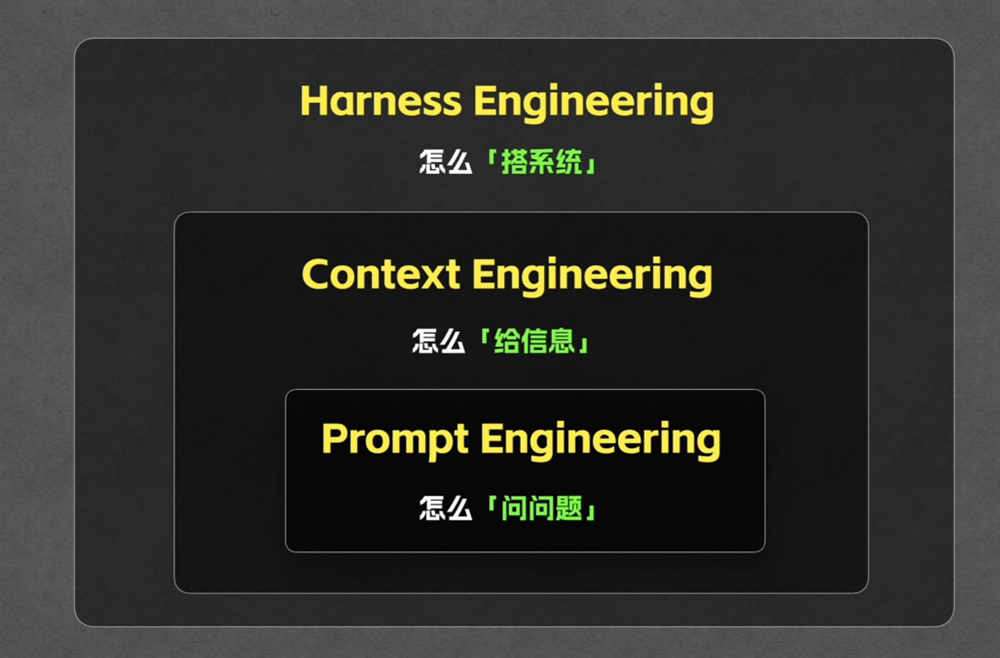

## AI 发展史

### 阶段 1 - Prompt Engineering 提示词工程

- 简单的说就是发给大模型的话, 它就是研究怎么把这句话说清楚的技术

### 阶段 2 - Context Engineering 上下文工程

- 通常发给大模型的内容有对话历史, 当前的问题, 工具列表等等, 但是上下文是有限的, 所以需要精心控制上下文内容

### 阶段 3 - Harness Engineering 工具工程

- Harness: 马具, 顾名思义, 它就是一个用来控制和驾驭大模型的系统

## 编程发展史

### 阶段 1 - Tab Coding

- 代码补全, 依靠 Tab 键无限补全代码

### 阶段 2 - Vibe Coding (氛围编程时代)

- 随问随改
- 缺点
  - 适合小项目, 不适合大项目
  - 适合逻辑简单的项目

### 阶段 3 - Spec Coding (编程范式)

- 先出规范的计划, 再编码
- 流程
  - 产品需求
  - 技术设计
  - 任务清单
- 优点
  - 适合大项目
  - 适合逻辑复杂的项目
- 历史
  - 手动写一堆 Rules
  - 让 Ai 先生成一个计划
  - 自动生成计划
