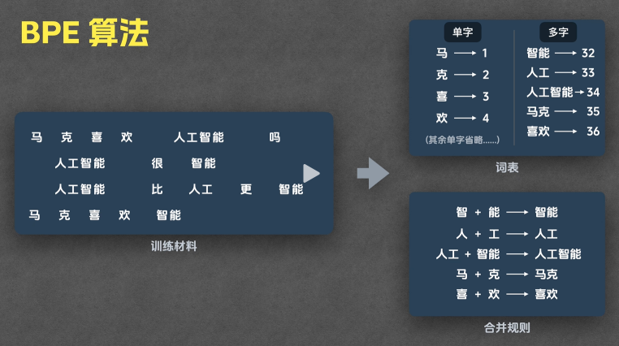

## 提示词

- User Prompt(用户提示词)
  - 即用户输入的文本
  - 例如："你好"、"请介绍一下你自己" 等
- System Prompt(系统提示词)
  - 用于描述 AI 模型的角色、性格、背景知识、语气等等(AI 内置的用户提示词, 用于引导模型生成符合预期的输出, 和用户提示词一起发送给 AI)
  - 例如："你是一个专业的翻译"、"请用中文回答" 等

## Tokenizer

- 编码
  - 例如：将 "Hello, world!" 转换为 [1, 2, 3, 4] 的 token
  - 步骤
    - [切分](#分词器)
      - 先切分为单个字符, 然后根据训练的合并规则, 合并相邻的字符
    - 映射
      - 然后根据词表, 将合并后的字符转换为 token ID
      - 例如：将 ["Hello", ",", "world", "!"] 转换为 [1, 2, 3, 4]
- 解码
  - 例如：[1, 2, 3, 4] 转换为 "Hello, world!"
  - 步骤
    - 映射
      - 与编码的过程相反
      - 例如：[1, 2, 3, 4] 映射为 ["Hello", ",", "world", "!"]
- 实现算法
  - Unigram
  - BPE(Byte Pair Encoding)
  - 

## 分词器

- 将文本转换为 token 的工具(按顺序切分成一个个的 token)
  - 例如：将 "Hello, world!" 转换为 ["Hello", ",", "world", "!"]

## token

- 也称为词元
- 是大模型理解内容的最小单元, 1 个 token 通常对应 1.5 个中文汉字或 0.75 个英文单词
- 每个 token 都有一个唯一的编号, 称为 Token ID
  - 例如：["Hello", ",", "world", "!"] 对应的 Token ID 为 [1, 2, 3, 4]

## Transformer 架构

- 来自谷歌的论文《Attention is all you need》
- 大模型使用的核心架构
- 采用了自注意力机制(很好的捕捉上下文关系)
- 参数
  - 单位: 十亿(Billion)
- 稠密模型(Dense Model)

  - 每次计算都调用所有的参数

- 稀疏模型(Sparse Model)

  - 每次计算只会调用相关的模型
    - 通过门控网络(gating network), 给每个问题分配合适的"专家"
  - 例如
    - 混合专家模型(MoE)(Mixture of Experts)(例如: deepseek、Gork)

## 预训练(Pre-training)

- 为了打造一个基座模型
- 通过"反向传播"的方法自行调整参数

  - 正向传播: 输入问题, 输出结果
  - 反向传播
    - 输入问题, 输出结果, 使其与正确结果进行对比, 看看差了多少, 这一步就是计算损失(loss)
    - 然后, 误差会从输出层反向传递到每一层, 通过链式法则计算每个参数对误差的影响(梯度)
    - 最后, 使用这些梯度来调整神经网络的参数, 使下一次预测更接近真实结果

- 因为工作量巨大, 所以使用"自监督学习"

## 后训练(Post-training)

- 因为经过预训练的基座模型并不能直接使用, 所以需要"微调"
- 微调
  - 监督微调(SFT)
    - 给 AI 提供带标注的数据集(人工数据标注员)
- 强化学习
  - GRPO: 不断告诉 AI 哪些答案是对的
  - RLHF
    - 人工数据标注员: 将回答按顺序排序
    - 奖励模型(Rewrad Model): 答案太多, 所以直接使用奖励模型对 AI 的回答进行打分, 这种叫做(RLHF)基于人工反馈的强化学习

## COT

- 思维链

## 蒸馏模型

- 满血版的高仿版
- 蒸馏模型(Distillation Model)是一种模型压缩的方法, 主要目的是将一个庞大且性能很强的“教师模型”(Teacher)中的知识, 迁移到一个体积较小、计算资源消耗更低的“学生模型”(Student)。训练过程中, 学生模型不仅学习教师模型对数据的标准结果(标签), 还学习教师模型对每个样本预测的“软输出”(概率分布), 这样学生模型能在保留高性能的同时, 大幅减少参数量和推理算力需求。
- 主要流程：
  - 先训练出表现很好的大模型作为“教师”
  - 用大模型对样本进行推理, 得到软标签(如类别的概率分布)
  - 小模型(学生)在训练时, 不只是学硬标签, 还学习这些软标签
- 优点：
  - 大幅减少模型体积, 提高推理速度
  - 在保证一定性能的前提下, 可以在边缘设备等算力受限环境部署
- 缺点：
  - 学生模型能力通常不可能完全追平教师模型

## 量化模型

- 满血版的压缩版

- 量化模型(Quantized Model)是一种通过将模型中的参数和计算从高精度(如 32 位浮点数)压缩为低精度(如 8 位整数)实现模型压缩和加速的方法。这样可以显著减少模型的存储体积和推理时所需的计算资源。
  - 优点：
    - 大幅减少模型大小, 降低存储和内存占用
    - 显著提升推理速度, 降低功耗, 适合在移动端和嵌入式设备部署
  - 缺点：
    - 量化后可能略微损失模型的推理精度, 尤其在极端压缩时
  - 应用场景：
    - 算力受限或需要高速响应的设备, 如手机、IoT 设备、浏览器等
